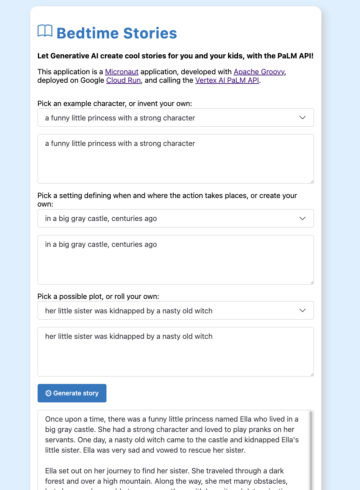

## Using the Google Cloud Vertex AI PaLM API to create kid stories

This application takes advantage of the PaLM API, in Google Cloud's Vertex AI, to generate kid stories.
Users select or invent a character, a setting (location, time), and a general plot.
This information is sent to the PaLM API, via a prompt, that asks for a structured story to be generated.
The frontend part is using vanilla JavaScript, with the [Shoelace](https://shoelace.style/) web components for the form inputs.
And the backend is developed with the [Micronaut](https://micronaut.io/) framework, 
the [Apache Groovy](https://groovy-lang.org/) programming language, and is deployed on [Cloud Run](https://cloud.run/).



Note: As of this writing, there is no Java client library to access the PaLM API. 
So this application is calling the REST endpoint directly.
However, to authenticate to that application, 
I had to use the Google [Auth client library](https://github.com/googleapis/google-auth-library-java),
as explained in this [article](https://glaforge.dev/posts/2023/05/30/getting-started-with-the-palm-api-in-the-java-ecosystem/).

## Building and deploying

You'll need to have the Vertex AI API enabled, as well as the various APIs needed by Cloud Run, Cloud Build, and Artifact Registry.

### Building with Cloud Build

```bash
gcloud builds submit -t us-central1-docker.pkg.dev/genai-java-demos/containers/bedtimestories:v1
```

Note: change the `genai-java-demos` with your own project ID.

### Deploying to Cloud Run

```bash
gcloud run deploy bedtimestories --image=us-central1-docker.pkg.dev/genai-java-demos/containers/bedtimestories:v1
```

Note: change the `genai-java-demos` with your own project ID.

---

This is not an official Google product.